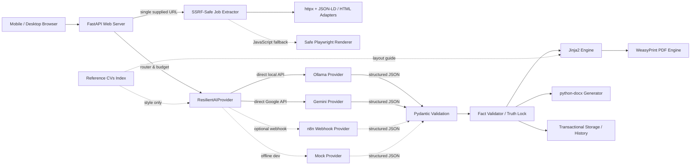

# CVTailor — AI Resume Tailoring Automation Platform

A private, mobile-first web application that analyzes specific job postings, evaluates candidate match against a verified master profile, enforces strict fact validation (Truth Lock), and generates ATS-friendly PDF and editable DOCX resumes.

CVTailor is designed as a production-grade, single-owner automation system demonstrating Python backend development, secure web extraction, structured LLM integration with resilient fallback, and deterministic document generation.

> [!IMPORTANT]
> **Essential Operating Principles & Disclaimers:**
> - **Single-posting analysis only**: CVTailor fetches and analyzes only explicitly provided job postings (one URL or pasted text at a time). It does **not** crawl or scrape job portals en masse.
> - **Documented evidence assessment, not hiring probability**: Match scores (HIGH / MEDIUM / LOW / UNRELIABLE) and recommendations (APPLY / REASONABLE STRETCH / SKIP / RETRY) evaluate alignment between job requirements and documented facts in the candidate profile. They do **not** represent probability of employment or an official ATS ranking.
> - **Fact validation bounds claims, not guarantees zero errors**: The Python-side Truth Lock validator eliminates ungrounded statements and unverified skills by mapping claims back to verified profile facts. However, human review of the analysis, profile facts, and rendered exports is always required before submitting an application.
> - **Third-party data transmission with Gemini**: While local Ollama inference keeps data strictly on your machine, configuring or falling back to Google Gemini transmits job and candidate analysis data to Google's Generative Language API.
> - **Security posture**: The platform is built for private, single-owner self-hosting. It implements Argon2id authentication, SQLite server-revocable sessions, CSRF tokens, SSRF guards, and rate limiting. It does **not** claim data encryption at rest, immunity to prompt injection, universal ATS compatibility, or public multi-tenant SaaS readiness.

---

## Architecture



### Core Components

1. **FastAPI Web Application**: Mobile-optimized UI powered by Jinja2 templates, vanilla modern CSS/JS, and asynchronous route handlers.
2. **SSRF-Safe Job Extractor**: Fetches a single user-supplied URL. Validates and pins IP addresses, prevents DNS rebinding, blocks internal/loopback/private IP ranges (RFC 1918, RFC 3927), limits redirects, and uses portal-specific parsers (JustJoin.it, NoFluffJobs.com, Pracuj.pl, MyWorkdayJobs), Schema.org JSON-LD extraction, and an optional Playwright headless browser fallback.
3. **Resilient AI Provider (`ResilientAIProvider`)**: Manages model calls for two structured stages (`JobAnalysis` and `TailoredResume`). Supports direct local Ollama, direct Google Gemini API, external n8n webhooks, and an offline mock provider, governed by an operation budget.
4. **Truth Lock (`FactValidator`)**: Strict Python boundary that maps model output back to the candidate's verified profile catalog (`data/master_profile.json`) and skills bank (`data/skills.json`). Replaces unevidenced paraphrases with verbatim profile facts and excludes unverified skills.
5. **Document Generators**:
   - **PDF Engine**: Uses Jinja2 and WeasyPrint to render pixel-accurate, multi-page A4 documents in either the Modern Sidebar or ATS Classic layout.
   - **DOCX Generator**: Uses `python-docx` to generate cleanly formatted, editable documents with active hyperlinks.
6. **Transactional Storage**: Saves job descriptions, structured analyses, resume JSON, metadata, and export artifacts under `data/generated/`. Manages atomic file staging, versioned backups in `versions/`, and rollback on write errors.

For an extended breakdown of pipeline stages and architectural decisions, see [Architecture Documentation](docs/architecture.md).

---

## Key Features

- **Grounded Requirement Analysis**: Breaks job postings into mandatory requirements, preferred qualifications, responsibilities, and organizational context. Evaluates alternatives (`OR`, `and/or`), example items (`such as`), and language proficiencies (e.g., verifying B2 without over-claiming C1). Incomplete extractions are flagged as `UNRELIABLE / RETRY`.
- **Verified Skills Bank**: CV skills are selected strictly from `data/skills.json`. A skill must be marked `verified`, `enabled`, `allowed_in_cv`, have a non-learning level, and be supported by concrete employment or project evidence (or explicitly confirmed `manual_verified`).
- **Two Resume Themes**:
  - `modern_sidebar`: Navy blue sidebar containing contact details, core skills, languages, an optional headshot or initials, and GDPR footer. Main section presents professional summary, experience bullets, projects, education, and certifications.
  - `ats_classic`: Single-column, minimalist, text-focused layout without photos or multi-column grids, maximizing automated ATS readability.
- **DOCX Export & Structure**: Produces an editable document with standard Word headings and hyperlinks. Because Word does not replicate HTML/CSS flexbox/grid sidebar layouts reliably, DOCX uses a clean single-column structure regardless of the chosen theme (placing the photo at the top in Modern Sidebar mode).
- **In-Browser Resume Editing**: Edit summary, skills, experience bullets, and project descriptions directly. Edits are re-validated by Truth Lock; unsupported claims return HTTP 422 and keep the form data intact without replacing the saved resume.
- **Single-User Security**: Authentication backed by Argon2id password hashing in `data/auth.json` (file mode `0600`), fixed-window login rate limiting (5 attempts per 5 minutes per IP), server-revocable SQLite sessions (`data/sessions.sqlite3`), signed cookies (`HttpOnly`, `SameSite=Strict`, `Secure` under HTTPS), and double-submit CSRF validation.

---

## AI Providers and Fallback Behavior

CVTailor decouples the application from the underlying LLM via `AIProvider`:

| Provider | Identifier | Connection Type | Target Use |
|---|---|---|---|
| **Ollama** | `ollama` | Local REST (`POST /api/chat`) | Default private local inference |
| **Google Gemini** | `gemini` | Direct Google API (`generativelanguage.googleapis.com`) | Cloud inference via Google AI Studio API key |
| **Auto** | `auto` | Managed Router (`ResilientAIProvider`) | Primary provider with automatic fallback |
| **Mock** | `mock` | Local Python generator | Offline development and automated testing |
| **n8n** | `n8n` | Webhook with `X-Webhook-Secret` | Delegated n8n workflow execution ([setup guide](docs/n8n-setup.md)) |

### Fallback Routing Rules

The active router evaluates provider preferences as follows:
- **`auto`**: Uses Ollama as primary, falling back to Gemini if Ollama fails or times out.
- **`ollama`**: Uses Ollama as primary, falling back to Gemini if fallback is enabled.
- **`gemini`**: Uses Gemini as primary, falling back to Ollama if fallback is enabled.
- **Fallback Toggle**: Controlled in the authenticated UI (`/settings/fallback`) and persisted in `data/ai_settings.json` (`{"automatic_fallback": true/false}`). When disabled, only the requested primary provider is called.
- **Operation Budget (`LLM_OPERATION_BUDGET_SECONDS`)**: Protects the overall pipeline. If the primary provider fails and the remaining budget is less than 5 seconds, fallback is aborted to prevent hung tasks.
- **Data Privacy Note**: Enabling Gemini (as primary or fallback) will transmit the job text and candidate master profile facts needed for analysis to Google's API endpoint.

---

## Installation & Quick Start

### Option A: Docker Deployment (Recommended for VPS)

Docker Compose uses `network_mode: host` on Linux so that the container can reach an Ollama instance running on host loopback (`127.0.0.1:11434`), while Uvicorn binds to `127.0.0.1:${CV_TAILOR_PORT:-8000}` behind your reverse proxy (see [VPS Deployment Guide](docs/deployment.md) for full reverse-proxy and TLS configuration).

1. **Clone the repository**:
   ```bash
   git clone https://github.com/Rafalbanas/ai-resume-tailoring-platform.git
   cd ai-resume-tailoring-platform
   ```

2. **Configure environment variables**:
   ```bash
   cp .env.example .env
   # Edit .env and configure strong random secrets for APP_PASSWORD and CSRF_SECRET
   ```

3. **Initialize candidate profile and skills bank**:
   ```bash
   cp data/master_profile.example.json data/master_profile.json
   cp data/skills.example.json data/skills.json
   # Replace example data with your verified candidate facts
   ```

4. **Build and launch the container**:
   ```bash
   docker compose up -d --build
   curl http://127.0.0.1:8000/health
   ```

5. **Initial login and credential migration**:
   Open `http://localhost:8000` (or your reverse-proxied HTTPS URL) and log in using `APP_USERNAME` and `APP_PASSWORD`. On first start, the plaintext password is automatically hashed to Argon2id in `data/auth.json`. You can then remove `APP_PASSWORD` from `.env`.

6. **Resetting passwords**:
   To change the password without using the UI:
   ```bash
   docker compose exec cv-tailor python -m app.cli reset-password
   ```

### Option B: Local Development (Python 3.12)

1. **Set up virtual environment**:
   ```bash
   python3.12 -m venv .venv
   source .venv/bin/activate
   pip install -r requirements-dev.txt
   python -m playwright install --with-deps chromium
   ```

2. **Configure local environment**:
   ```bash
   cp .env.example .env
   cp data/master_profile.example.json data/master_profile.json
   cp data/skills.example.json data/skills.json
   ```

3. **Run in offline mock mode**:
   Set `AI_PROVIDER=mock` in `.env` and start the server:
   ```bash
   uvicorn app.main:app --reload --port 8000
   ```

4. **Run with local Ollama**:
   Ensure Ollama is running (`curl http://127.0.0.1:11434/api/tags`), pull the model (`ollama pull qwen3.5:9b`), set `AI_PROVIDER=ollama` in `.env`, and start Uvicorn.

---

## Configuration Reference (`.env`)

All configurable environment variables correspond to `.env.example`:

| Variable | Default Value | Description |
|---|---|---|
| `APP_USERNAME` | — | Initial username for first-run credential bootstrap |
| `APP_PASSWORD` | — | Initial password for first-run bootstrap (migrated to Argon2id hash in `data/auth.json`) |
| `CSRF_SECRET` | — | Secret key used for signing double-submit CSRF tokens |
| `BASE_URL` | `https://cv.example.com` | Public base URL; enables `Secure` flag on cookies when using HTTPS |
| `DATA_DIR` | `/app/data` (Docker) or `data` | Directory for master profile, skills bank, auth, and generated resumes |
| `CV_TAILOR_PORT` | `8000` | Loopback port bound by Uvicorn under Docker host networking |
| `RATE_LIMIT_PER_MINUTE` | `20` | Maximum requests per minute per IP for mutating endpoints |
| `AI_PROVIDER` | `ollama` | Active provider: `ollama`, `gemini`, `auto`, `mock`, or `n8n` |
| `LLM_PROVIDER` | `ollama` | Alias for AI provider selection |
| `LLM_FALLBACK_PROVIDER` | `gemini` | Secondary provider for automatic fallback: `gemini`, `ollama`, or `none` |
| `PROFILE_MODE` | `production` | Profile mode: `production` (requires private `skills.json`) or `sample` |
| `LLM_OPERATION_BUDGET_SECONDS` | `900.0` | Total time budget covering analysis, resume tailoring, and fallback |
| `OLLAMA_BASE_URL` | `http://127.0.0.1:11434` | Ollama API endpoint |
| `OLLAMA_MODEL` | `qwen3.5:9b` | Model name used for structured JSON generation in Ollama |
| `OLLAMA_CONNECT_TIMEOUT_SECONDS` | `10.0` | Connection timeout for Ollama |
| `OLLAMA_READ_TIMEOUT_SECONDS` | `300.0` | Per-stage inference timeout for Ollama |
| `OLLAMA_TIMEOUT_SECONDS` | `300.0` | Overall HTTP client timeout for Ollama requests |
| `OLLAMA_KEEP_ALIVE` | `15m` | Duration to keep the model warm in Ollama memory |
| `OLLAMA_MAX_CONCURRENCY` | `1` | Maximum concurrent Ollama requests allowed |
| `OLLAMA_NUM_PREDICT` | `8192` | Maximum generated tokens per Ollama call |
| `OLLAMA_NUM_CTX` | `32768` | Context window size for Ollama requests |
| `GEMINI_API_KEY` | — | Google AI Studio API key (leave empty if not using Gemini) |
| `GEMINI_MODEL` | `gemini-3.1-flash-lite` | Gemini model identifier |
| `GEMINI_BASE_URL` | `https://generativelanguage.googleapis.com` | Google Generative Language API base URL |
| `GEMINI_CONNECT_TIMEOUT_SECONDS` | `15.0` | Connection timeout for Gemini API |
| `GEMINI_READ_TIMEOUT_SECONDS` | `60.0` | Response read timeout for Gemini API |
| `GEMINI_TIMEOUT_SECONDS` | `60.0` | Total request timeout for Gemini API |
| `GEMINI_MAX_RETRIES` | `0` | Transient error retry count for Gemini |
| `JOB_FETCH_TIMEOUT_SECONDS` | `12.0` | Timeout for fetching an external job URL |
| `JOB_FETCH_MAX_BYTES` | `2000000` | Maximum allowed size (2 MB) for downloaded job HTML |
| `JOB_FETCH_MAX_REDIRECTS` | `3` | Maximum HTTP redirects followed by the safe fetcher |
| `JOB_FETCH_PLAYWRIGHT_ENABLED` | `true` | Enables JavaScript headless browser rendering fallback |
| `MAX_JOB_DESCRIPTION_CHARS` | `30000` | Maximum character length for job description text |
| `REFERENCE_CV_MAX_BYTES` | `10000000` | Maximum file size (10 MB) for uploaded reference PDF/DOCX |
| `PROFILE_PHOTO_MAX_BYTES` | `5000000` | Maximum file size (5 MB) for uploaded profile photos |
| `REQUEST_TIMEOUT_SECONDS` | `60.0` | HTTP request timeout for n8n webhook calls |
| `N8N_WEBHOOK_URL` | — | Optional n8n production webhook URL |
| `N8N_WEBHOOK_SECRET` | — | Shared secret sent to n8n via `X-Webhook-Secret` header |
| `APP_BUILD_SHA` | `development` | Git commit SHA embedded in diagnostic views |
| `APP_BUILD_TIMESTAMP` | `unknown` | Build timestamp embedded in diagnostic views |

---

## Candidate Profile & Skills Bank

### Master Profile (`data/master_profile.json`)

The candidate master profile is the single source of truth for all personal facts, employment history, education, projects, languages, and certifications.
- An example structure is provided in `data/master_profile.example.json`.
- The production profile `data/master_profile.json` is ignored by Git and should never be committed.

### Verified Skills Bank (`data/skills.json`)

Skills in generated CVs are selected strictly from `data/skills.json`.
- To bootstrap an initial skills bank from an existing `master_profile.json`, run:
  ```bash
  PYTHONPATH=. python scripts/bootstrap_skills.py
  ```
  *(This script refuses to overwrite an existing `skills.json` file).*
- Manage skills, levels, and evidence via the authenticated web interface at `/skills`.
- `/health/skills` exposes bank validity, total skills, verified count, and learning count without revealing personal data.

### Reference CV Library

Upload past PDF/DOCX resumes under the **Reference CVs** section (`data/reference_cvs/`). Ingestion extracts stylistic properties such as typical section density, bullet phrasing style, and section order. Models receive up to two similar reference CVs as **style-only guidance**; they cannot introduce facts from reference CVs into the candidate profile.

---

## Isolated Recording Demo

For creating video demonstrations or capturing screenshots without exposing personal candidate data, CVTailor includes an isolated demo runner:

1. **Initialize the demo environment**:
   ```bash
   .venv/bin/python scripts/recording_demo.py init
   ```
   This generates synthetic candidate data ("Alex Example"), a fictional skills bank, a dedicated CSRF secret, and a one-time random password for the `recording-demo` user under `~/.local/share/cvtailor-recording-demo`.

2. **Run the demo server**:
   ```bash
   .venv/bin/python scripts/recording_demo.py run
   ```
   Starts a separate Uvicorn instance on `127.0.0.1:18001` with `root_path="/demo"`, using isolated cookie names (`demo_session` and `demo_csrf_token`).

3. **Cleanup**:
   Stop the process and delete the demo data directory (`~/.local/share/cvtailor-recording-demo`).

> [!NOTE]
> The recording demo is intended for private video captures and local walkthroughs (see [Recording Demo Guide](docs/recording-demo.md)). It is **not** an isolated multi-tenant public demo environment.

---

## Testing & Quality Assurance

Run code formatting checks and test suites locally:

```bash
# Check code style and formatting
ruff check .

# Run test suite
pytest -q
```

### Known Limitations

- **Heuristic Job Section Parsing**: Job listings with irregular formatting, missing headers, or nested iframes may not parse cleanly via static extraction. In such cases, the system falls back to `manual_required` (prompting the user to paste the job description text).
- **DOCX Layout Approximation**: DOCX export does not replicate the HTML/CSS two-column layout of the Modern Sidebar theme. It generates a single-column document with centered headers to preserve editability and ATS compatibility.
- **Single-Owner Scope**: The software is designed for single-user self-hosting. Multi-user isolation, team roles, and public SaaS onboarding are not implemented.
- **Review Requirement**: Truth Lock enforces source fact IDs and exact sentence replacement, but semantic nuances and job-specific relevance still require human review.

---

## License & Attribution

This project is licensed under the **Apache License, Version 2.0**.

- Full license text: [LICENSE](LICENSE)
- Copyright and project notices: [NOTICE](NOTICE)

Under the terms of the Apache License 2.0, you are free to use, modify, distribute, and sublicense this software, including for commercial purposes, subject to the conditions set forth in the license.
