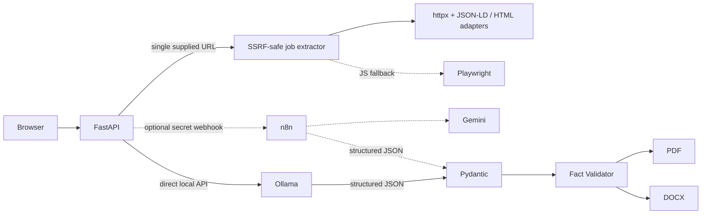

# AI Resume Tailoring Automation Platform

A private, mobile-first application that fetches or accepts a job description, compares it with a verified master profile, and produces an ATS-friendly PDF and editable DOCX resume. It is a production-shaped portfolio project demonstrating Python, automation, secure web extraction, DevOps, and fact-constrained AI integration.

> **Fact-constrained AI generation prevents the LLM from adding unsupported skills, technologies or certifications.**

## What it does

- Accepts a company, role, optional URL, and pasted job description.
- Fetches a single user-supplied job URL through SSRF-protected HTTP, JSON-LD/site adapters, and a Playwright fallback.
- Sends the job and master profile to an existing n8n webhook; n8n uses its own Google Gemini credential.
- Validates `JobAnalysis` and `TailoredResume` with Pydantic.
- Independently enforces Truth Lock in Python by resolving model-selected source IDs back to exact master-profile facts.
- Shows a qualitative HIGH / MEDIUM / LOW match report with APPLY / REASONABLE STRETCH / SKIP guidance.
- Renders a deterministic, single-column A4 resume with Jinja2 and WeasyPrint.
- Exports an editable, ATS-friendly DOCX and keeps local application history.
- Maintains a private PDF/DOCX reference-CV library for local style examples and deterministic layout guidance.
- Protects the private UI with HTTP Basic Auth backed by an Argon2id hash, CSRF validation, input limits, rate limiting, safe paths, timeouts, and secret-authenticated n8n calls.

## Architecture



`AIProvider` isolates the application from the model runtime. Production can use `OllamaProvider` directly against a local Ollama API, while `N8NGeminiProvider` remains available and `MockAIProvider` supports offline development. FastAPI never needs a Gemini key.

## Quick start

### Docker (production-shaped)

```bash
cp .env.example .env
# Set unique secrets in .env
cp data/master_profile.example.json data/master_profile.json
# Replace the fictional profile with verified facts
docker compose up -d --build
curl http://127.0.0.1:8000/health
```

Open `http://localhost:8000` and sign in with the initial `APP_USERNAME` / `APP_PASSWORD`. The first start migrates the password to a persistent Argon2id hash; plaintext `APP_PASSWORD` can then be removed from `.env`.

### Local mock mode

This verifies the complete UI, validation, storage, PDF, and DOCX flow without calling Gemini:

```bash
python3.12 -m venv .venv
. .venv/bin/activate
pip install -r requirements-dev.txt
cp .env.example .env
# Set initial auth values, AI_PROVIDER=mock, BASE_URL=http://localhost:8000, DATA_DIR=data
cp data/master_profile.example.json data/master_profile.json
uvicorn app.main:app --reload
```

For a useful demo, replace the explicitly fictional example with verified facts and skills in `data/master_profile.json`; the application must not pretend to know the candidate.

## Environment

| Variable | Purpose |
|---|---|
| `N8N_WEBHOOK_URL` | Active production webhook of the imported workflow |
| `N8N_WEBHOOK_SECRET` | Shared secret sent as `X-Webhook-Secret` |
| `APP_USERNAME` / `APP_PASSWORD` | First-run inputs for single-user authentication; the password is migrated to Argon2id |
| `CSRF_SECRET` | Signs the double-submit CSRF token |
| `BASE_URL` | Public application URL; enables Secure cookies under HTTPS |
| `DATA_DIR` | Master profile and generated application storage |
| `AI_PROVIDER` | `ollama` for direct local inference, `n8n` for the webhook, or `mock` for offline verification |
| `OLLAMA_BASE_URL` | Local Ollama API base URL (default `http://127.0.0.1:11434`) |
| `OLLAMA_MODEL` | Ollama model used for both structured stages (default `qwen3.5:9b`) |
| `OLLAMA_TIMEOUT_SECONDS` | Timeout for each local inference stage (default `300`) |
| `REFERENCE_CV_MAX_BYTES` | Maximum size of one private reference PDF/DOCX (default `10000000`) |
| `REQUEST_TIMEOUT_SECONDS` | n8n request timeout |
| `CV_TAILOR_PORT` | Loopback port used by Uvicorn under Docker host networking (default `8000`) |
| `JOB_FETCH_TIMEOUT_SECONDS` | Timeout for a single job-page fetch |
| `JOB_FETCH_MAX_BYTES` | Maximum downloaded/rendered job page size |
| `JOB_FETCH_MAX_REDIRECTS` | Maximum redirects followed after validating each target |
| `JOB_FETCH_PLAYWRIGHT_ENABLED` | Enables JavaScript-rendered page fallback |

Do not add Gemini, OpenAI, or Anthropic keys to this repository.

`APP_USERNAME` and `APP_PASSWORD` are migration inputs only. On the first successful start they are hashed into `data/auth.json`. Remove `APP_PASSWORD` from `.env` after verifying the migration. Change the password in the authenticated UI at `/account/password`, or reset it from the VPS without the old password:

```bash
docker compose exec cv-tailor python -m app.cli reset-password
```

The CLI prompts twice without echoing the password. The persistent credential file contains an Argon2id hash, is written atomically, and has mode `0600`.

## Ollama, n8n, and Gemini

The default production configuration calls Ollama twice through `POST /api/chat`: first for `JobAnalysis`, then for `TailoredResume`. Each request supplies the corresponding JSON Schema. Pydantic validates both responses and the independent Python Fact Validator remains the final boundary before export.

## Private reference CVs and layout

Authenticated users can upload multiple PDF/DOCX files under **Reference CVs**. Files and the generated `data/reference_cvs/index.json` stay inside the ignored private data directory. Ingestion extracts role, summary, skills, experience-bullet examples, and section order. Ollama receives at most two similar references as style-only examples; the verified master profile remains the only permitted source of facts, and Truth Lock still rewrites/removes unsupported output.

PDFs use the deterministic one-page `modern_sidebar` Jinja2/CSS template: navy sidebar, optional private `data/profile_photo.jpg` (also ignored), contacts and skills on the left, content on the right, and a fixed GDPR footer. The page-fit pass shortens bullets first, then removes lower-priority skills, without reducing the base font below 8 pt.

On a Linux VPS, Docker Compose uses host networking so `http://127.0.0.1:11434` refers to the host Ollama service. Uvicorn is explicitly bound to `127.0.0.1:${CV_TAILOR_PORT:-8000}`. Check readiness without sending profile data at `GET /health/provider`.

Import [`n8n/cv-tailoring-workflow.json`](n8n/cv-tailoring-workflow.json), select the existing Gemini credential in both model nodes, configure the matching webhook secret in n8n, activate the workflow, and place its production URL in `.env`. Full steps are in [`docs/n8n-setup.md`](docs/n8n-setup.md).

The workflow uses two controlled chains: job analysis and resume selection. Both use structured output parsers. Pydantic validation and the Python Fact Validator remain mandatory because model-side structured output is not a security boundary.

## Test the whole flow

1. Run `ruff check .` and `pytest -q`.
2. Start with `AI_PROVIDER=mock`; analyze a description containing a known skill and an unknown one such as Kubernetes.
3. Generate the CV and confirm the unknown skill appears under Missing but not in preview, `resume.json`, PDF, or DOCX.
4. Switch to `AI_PROVIDER=ollama`, confirm `/health/provider`, start the app, and repeat the job with the local model.
5. Download both exports and verify the PDF is selectable text and the DOCX is editable.
6. Repeat from a phone-sized browser viewport and confirm all actions remain reachable.

## Quality and operations

```bash
ruff check .
pytest -q
docker compose config
docker compose up -d --build
docker compose ps
```

GitHub Actions runs lint and tests on pushes and pull requests. It does not deploy production. Logs include request ID, stage, duration, errors, and validator warning count, but not secrets or full CV content.

## Repository map

- `app/models/` — candidate, job-analysis, and resume contracts.
- `app/services/job_extractors/` — SSRF-safe fetching, JSON-LD parsing, portal adapters, and Playwright fallback.
- `app/services/fact_validator.py` — independent Truth Lock enforcement.
- `app/services/n8n_provider.py` — timeout-bound n8n integration.
- `templates/` and `static/` — mobile UI and deterministic A4 resume.
- `data/master_profile.json` — the only candidate source of truth.
- `data/master_profile.example.json` — fictional public example; the real profile is intentionally ignored by Git.
- `n8n/` — importable Gemini workflow.
- `tests/` — schemas, adversarial fact checks, PDF, storage, and filenames.
- `docs/` — architecture, n8n setup, and VPS deployment.

## Current scope and next steps

Job extraction is deliberately limited to one URL explicitly supplied by the signed-in user. It does not crawl listings or bypass portal protections; failed extraction keeps manual paste as the fallback. Recommended next additions:

1. A master-profile editor with explicit review and version history.
2. A visual page-fit report that suggests which verified facts to remove before export.
3. Optional application-status tracking (applied, interview, rejected) in the existing local storage model.
