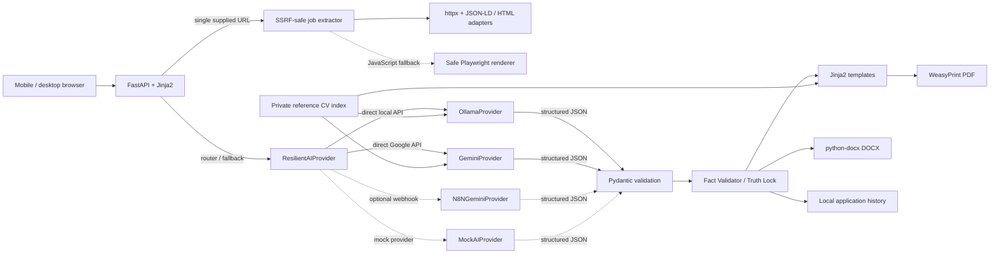

# Architecture

The provider boundary is `AIProvider` coordinated by `ResilientAIProvider`. Supported providers include:
- `OllamaProvider`: direct local Ollama inference via `POST /api/chat`.
- `GeminiProvider`: direct Google Gemini API integration using `GEMINI_API_KEY`.
- `N8NGeminiProvider`: optional webhook integration calling an external n8n instance.
- `MockAIProvider`: deterministic offline provider for development and testing.

Bidirectional automatic fallback (Ollama <-> Gemini) is configurable and guarded by an operation budget. Using the direct Gemini provider transmits job and profile analysis data to Google's Generative Language API.

Reference PDFs/DOCX and their derived index live in ignored `data/reference_cvs/`. They influence example wording, density, and section ordering, but never candidate facts. Resumes support two themes:
- `ats_classic`: single-column, standard layout without photo, natural multi-page flow.
- `modern_sidebar`: two-column layout with navy sidebar, optional photo/initials, natural multi-page flow.

## Truth Lock

The AI provider selects source IDs (`summary:0`, `experience:0:fact:1`, `project:0:fact:0`) and eligible skill IDs from the verified skills bank. The independent Python validator resolves those IDs back to exact profile facts, canonicalizes skills, companies, roles, dates, projects, education, and certifications, and removes unsupported objects. This is deliberately stricter than semantic LLM checking: only exact referenced source sentences are accepted for automatic bullet export. Professional summaries select source sentences by role, with education and explicitly labelled project work. Source requirement clauses preserve AND, qualifiers and priorities; uncertain scope is partial and mandatory gaps block APPLY. Editing rejects unsupported wording without replacing the saved CV. Export updates render in staging first, back up previous versions, and roll back write errors.

## Storage

Each completed application is stored under `data/generated/YYYY-MM-DD_company_role/`. The directory contains the original job description, validated analysis and resume JSON, metadata, PDF, and DOCX.
