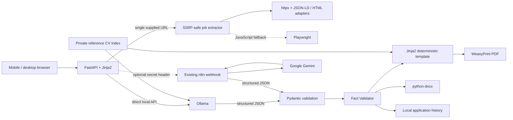

# Architecture

The provider boundary is `AIProvider`; production uses direct local `OllamaProvider`, `N8NGeminiProvider` remains available, and a deterministic mock supports local development. FastAPI never receives a Gemini credential.

Reference PDFs/DOCX and their derived index live only in ignored `data/reference_cvs/`. They influence example wording, density, and section order, never candidate facts. The rendered PDF uses the fixed `modern_sidebar` template and a deterministic one-page fitting sequence.

## Truth Lock

Gemini selects source IDs (`summary:0`, `experience:0:fact:1`, `project:0:fact:0`). The independent Python validator resolves those IDs back to exact profile facts, canonicalizes skills, companies, roles, dates, projects, education, and certifications, and removes unsupported objects. This is deliberately stricter than semantic LLM checking: no generated bullet text is trusted.

## Storage

Each completed application is stored under `data/generated/YYYY-MM-DD_company_role/`. The directory contains the original job description, validated analysis and resume JSON, metadata, PDF, and DOCX.
